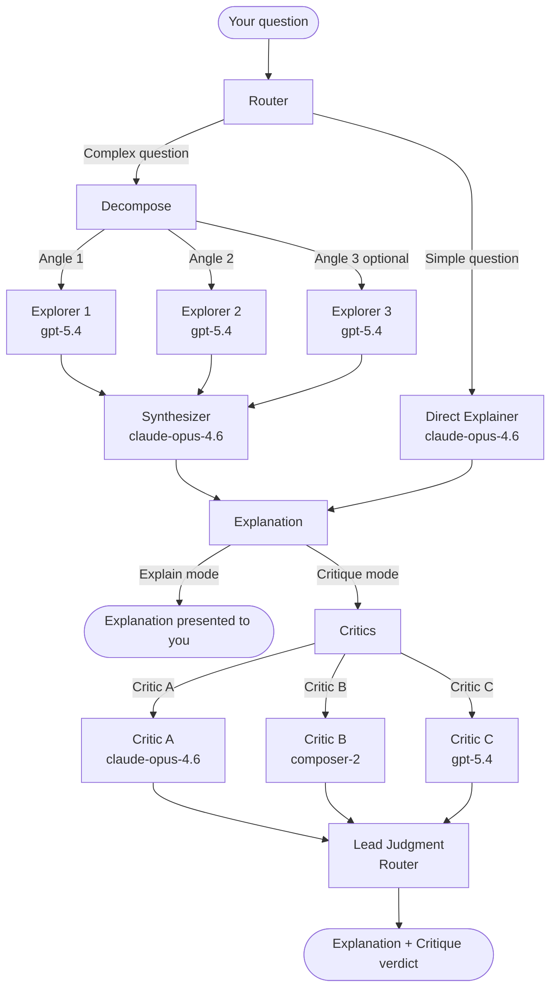

How is built on a multi-agent architecture where a router agent orchestrates a set of specialized subagents, each with a distinct role and a carefully chosen model. No single agent does everything. The router decides what needs to happen, decomposes the work, and hands it off — then collects the results and presents them to you. Every subagent that reads your codebase runs with `readonly: true`, ensuring the skill never modifies a file.

## The full agent flow

## The router agent

The router is the top-level agent — the one that runs when you invoke How. It is the only agent with awareness of the full pipeline. Its responsibilities are:

- **Parse the question** — identify the scope and what is being asked.
- **Assess complexity** — decide simple vs. complex, explain vs. critique.
- **Decompose** — for complex questions, choose the exploration angles and write the per-angle instructions for each explorer.
- **Orchestrate** — spawn subagents, collect their results, and pass the right outputs to the next step.
- **Present** — take the explainer's output and deliver it to you, applying light edits for context if needed.
- **Lead judgment** — in critique mode, categorize critic findings into Act on, Consider, Noted, and Dismissed.

The router does not do codebase exploration itself. It delegates all read work to readonly subagents.

## Explorer subagents

Explorers are spawned only for complex questions. Two to four run in parallel — all launched in a single message so they execute concurrently.

| Property | Value |
|---|---|
| `subagent_type` | `generalPurpose` |
| `model` | `gpt-5.4` |
| `readonly` | `true` |

Each explorer receives the base instructions from `references/explorer-prompt.md` plus a specific exploration angle — the slice of the subsystem it is responsible for. The angle is written by the router during decomposition.

Explorers are optimized for thoroughness. They trace call chains, read implementations, map type definitions, and note non-obvious behavior. They return structured findings — not prose — because a separate synthesizer is responsible for the human-facing writing. Overlap between explorers is expected and fine; the synthesizer handles reconciliation.

<Tip>
  Explorer subagents use `gpt-5.4` because the task is fact-gathering: find entry points, trace flows, read types. It does not require the same synthesis and communication strengths needed for writing the explanation.
</Tip>

## Synthesis subagent (explainer)

The synthesizer runs after all explorers return and is responsible for turning structured findings into the explanation you read.

| Property | Value |
|---|---|
| `subagent_type` | `generalPurpose` |
| `model` | `claude-opus-4.6` |
| `readonly` | `true` |

The synthesizer receives all explorer findings and the original question. Its job is to reconcile overlapping descriptions, resolve contradictions (checking the actual code when needed to break a tie), and weave the separate slices into a unified explanation following the standard output format. It has read-only codebase access to fill gaps, but the explorers already did the heavy lifting.

For simple questions, the same model and configuration is used — but as a direct explainer that does its own exploration in a single pass rather than receiving pre-gathered findings.

<Note>
  `claude-opus-4.6` is used for the explainer and synthesizer because the output is the product — the explanation you read. Writing clearly, using concrete language, and weaving disparate findings into a coherent narrative is where this model's strengths matter.
</Note>

## Critic subagents

Critic subagents run only in critique mode, after the explanation is complete. Three critics run in parallel — launched in a single message.

| Critic | Model | Reasoning |
|---|---|---|
| Critic A | `claude-opus-4.6` | Strong structural reasoning, consistent with the synthesizer's perspective |
| Critic B | `composer-2` | Different priors and model family, surfaces issues the others may frame differently |
| Critic C | `gpt-5.4` | Broad training distribution, catches patterns the others may normalize |

All critics share the same configuration:

| Property | Value |
|---|---|
| `subagent_type` | `generalPurpose` |
| `model` | See table above |
| `readonly` | `true` |

Each critic receives: the explanation from the explain pass (as a map, not gospel), the relevant file paths, and the critique rubric from `references/critique-rubric.md`. Critics form their own judgment from the actual code — the explanation might frame things charitably, and critics are expected to read past it.

The three-model approach is intentional. Different models have different priors about what good architecture looks like. Running three independent reviewers on different models produces a wider, less correlated set of findings than three instances of the same model would.

## Why readonly matters

Every subagent that accesses your codebase — explorers, synthesizer, direct explainer, and critics — runs with `readonly: true`. This flag ensures that:

- No subagent can create, edit, or delete files during exploration or critique.
- The skill is safe to run on production codebases without risk of unintended modifications.
- You can trust that any explanation or critique reflects the code as it exists, not as it was accidentally changed during analysis.

The router itself does not access the codebase directly. All file access flows through readonly subagents.

## Agent summary

| Agent | Spawned by | Model | Readonly | When |
|---|---|---|---|---|
| Router | You (via How) | — | — | Always |
| Explorer (×2–4) | Router | `gpt-5.4` | Yes | Complex questions |
| Synthesizer | Router | `claude-opus-4.6` | Yes | Complex questions (after explorers) |
| Direct explainer | Router | `claude-opus-4.6` | Yes | Simple questions |
| Critic A | Router | `claude-opus-4.6` | Yes | Critique mode only |
| Critic B | Router | `composer-2` | Yes | Critique mode only |
| Critic C | Router | `gpt-5.4` | Yes | Critique mode only |
